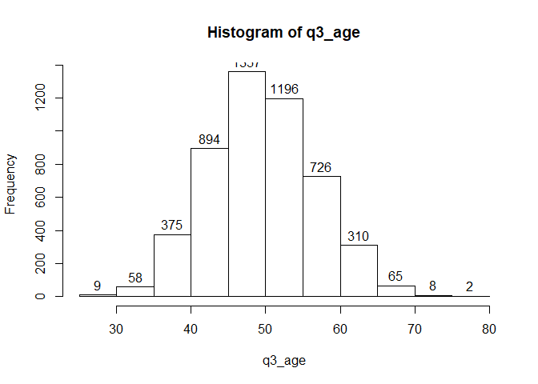

### Introduction - R Training 4

This is the training notes for 4th Rainmakers R Training session, where the aim is to introduce R with a focus on analysing survey data, or data types commonly found in market or strategy research. The document will cover more advanced topics in R (*advanced* may sound intimidating - but I guarantee they're highly valuable!), including:

* simulating your own data
* for loops
* `apply()` family of functions
* how to write your own custom functions. 

These tricks and concepts will still be introduced with *practical usage in research * in mind and therefore will focus more on data examples close to what we find in research. However, if you'd like to do a bit of further reading do check out this blogpost available on R-bloggers <https://www.r-bloggers.com/r-tutorial-on-the-apply-family-of-functions/>.

Like in the previous training documents, the R code used here will largely follow the tidyverse / dplyr conventions of using pipe operators (`%>%`). The principle behind this is the cleaner, more readable code that results from using these conventions. Despite the fact they make the code marginally slower (literally by micro-seconds), the bottlenecks in data analysis tends to be in thinking and planning (coding) rather than computation, and hence the trade-off for more readable code is surely justified. 

---

### 1. Simulating your own dataset

To completely eliminate any possibility of infringeing GDPR or other privacy issues that comes from using a 'real' dataset, we will try to simulate our own datasets for the purpose of this training. The main workhorse functions that we will use to do this are:  

* `sample()`
* `tibble()` / `data.frame()` (doesn't really matter which one you use - I'd recommend `tibble`) [Read this if you want the details](https://cran.r-project.org/web/packages/tibble/vignettes/tibble.html)
* `rpois()` (I've found most useful for generating age data)
* `matrix()` - useful for generating a large number of random binary variables

Before you run the following, ensure you start with loading tidyverse with `library(tidyverse)`. The first step is to create some vectors with a consistent size of 5000, which we will use as the columns in our data frame / tibble. With the `sample()` function, the `x` argument specifies what you would like to have as values, and the `prob` argument specifying the probability of occurrence for each of those values (omitting this argument will return an even split). Here is an example created for gender, which I've labelled as `q2_gender`:


```r
q2_gender <- sample(x = c("Male","Female","Other"),
                 size = 5000,
                 prob = c(.48,.51,.01),
                 replace = TRUE)
```

Another useful function for simulating data, particularly for integers, is the `rpois()` function. This generates a Poisson distribution, where `n` specifies the number of random values to return and `lambda` specifies the mean of the distribution (must be non-negative). To get a sense of what you've actually simulated, use the `hist()` function to plot a histogram of the simulated vector; it's also good practice to use `summary()` to review some summary statistics.

As you'll see below, `rpois()` generates a somewhat 'realistic' age distribution that you would expect from an actual dataset:

```r
q3_age <- rpois(n = 5000, lambda = 50)

hist(q3_age, labels = TRUE) # Plot histogram, show value labels
```

<!-- -->

```r
summary(q3_age)
```

```
##    Min. 1st Qu.  Median    Mean 3rd Qu.    Max. 
##   24.00   45.00   50.00   50.01   55.00   79.00
```

All of these newly simulated vectors can then be specified as columns in a tibble / data frame. Note that you don't need to create the simulations **outside** the `tibble()` function; you can always condense your code making all the simulation calls within `tibble()`. For instance, the `ID` column below is generated directly within the `tibble()` function. In some occasions however, you may choose to explicitly declare the vectors to enhance the readability of the code.

The `sim_data` tibble object created below will have 5000 rows and 3 variables, containing an ID, gender, and an age variable. You can use `glimpse()` or `View()` to explore what you have created. Note that because these variables are randomly generated, you will not get the same dataset everytime you run the same code. (`set.seed()` is a trick to overcome this, which you can read more about [here](http://rfunction.com/archives/62))


```r
sim_data <- tibble(ID = 1:5000,
                   Q2_GENDER = q2_gender,
                   Q3_AGE = q3_age)
```

Now, let us use the following code to simulate a dataset that represents the consumption of snacks over the three snacking occasions of "pre-lunch" (**PRELUN**), "post-lunch" (**POSLUN**), and "late-afternoon" (**LATAFT**). To make the data slightly more interesting, the probabilities of some variables are pre-specified. The survey question capturing these consumption variables can be:

> Please select all of the following snack types that you have consumed around [INSERT INTERVAL] in the past week.

Note that all the brand consumption variables generated below are in the form of binary variables taking on only the values of 0 and 1, where 0 is assumed to be 'Not Selected' and 1 is assumed to be 'Selected'. Imagine that the snack types 1, 2, and 3 represent Jaffa cakes, Rich Tea biscuits, and 'Posh chocolates' respectively. 


```r
snack_data <- tibble(ID = 1:5000,
                     Q2_GENDER = q2_gender,
                     Q3_AGE = q3_age,
                     PRELUN_1 = sample(x = c(0,1), 5000, replace = TRUE, prob = c(.45, .55)), # Jaffa
                     PRELUN_2 = sample(x = c(0,1), 5000, replace = TRUE, prob = c(.65, .35)), # Tea Biscuits
                     PRELUN_3 = sample(x = c(0,1), 5000, replace = TRUE), # Posh chocs
                     
                     POSLUN_1 = sample(x = c(0,1), 5000, replace = TRUE), # Jaffa
                     POSLUN_2 = sample(x = c(0,1), 5000, replace = TRUE), # Tea Biscuits
                     POSLUN_3 = sample(x = c(0,1), 5000, replace = TRUE, prob = c(.45, .55)), # Posh chocs
                     
                     LATAFT_1 = sample(x = c(0,1), 5000, replace = TRUE), # Jaffa
                     LATAFT_2 = sample(x = c(0,1), 5000, replace = TRUE, prob = c(.90, .10)), # Tea Biscuits
                     LATAFT_3 = sample(x = c(0,1), 5000, replace = TRUE)) # Posh chocs
```

Based on the structure created above, we can even create a larger dataset with more binary variables (brand consumption) which will be a closer resemblance to larger, wider data in Usage & Attitude / U&A surveys . The `matrix()` function below creates a 5000 by 30 matrix (specified by the arguments `nrow` and `ncol`), taking on the values of either 0 or 1 generated by the `sample()` function. In other words, we are asking the `sample()` function to generate 15,000 binary values to fill a 5000 x 30 table.


```r
matrix(data = sample(x = c(0,1),30 * 5000, replace = TRUE),
       nrow = 5000,
       ncol = 30) %>%
  as_tibble() -> brand_con_sim # Simulated Brand Consumption, 30 columns x 5000 rows

# Give column names to the simulated brand consumption data
names(brand_con_sim) <- c(paste0("PRELUN_",1:10),
                          paste0("POSLUN_",1:10),
                          paste0("LATAFT_",1:10))

# Simulate ID, Gender, and Age variables
# Use cbind() to combine with the simulated brand consumption data

tibble(ID = 1:5000,
       Q2_GENDER = q2_gender,
       Q3_AGE = q3_age) %>%
  cbind(brand_con_sim) -> big_snack_data

glimpse(big_snack_data[,1:15]) # Glimpse first 15 columns only
```

```
## Observations: 5,000
## Variables: 15
## $ ID        <int> 1, 2, 3, 4, 5, 6, 7, 8, 9, 10, 11, 12, 13, 14, 15, 1...
## $ Q2_GENDER <chr> "Male", "Male", "Male", "Male", "Female", "Male", "F...
## $ Q3_AGE    <int> 49, 57, 45, 44, 51, 41, 51, 54, 58, 55, 46, 46, 46, ...
## $ PRELUN_1  <dbl> 1, 0, 1, 1, 0, 0, 1, 0, 1, 1, 0, 0, 0, 1, 1, 1, 1, 1...
## $ PRELUN_2  <dbl> 1, 0, 1, 0, 0, 0, 1, 0, 0, 0, 1, 0, 1, 0, 1, 1, 1, 0...
## $ PRELUN_3  <dbl> 0, 1, 0, 1, 0, 0, 0, 0, 0, 0, 1, 0, 0, 1, 1, 0, 1, 1...
## $ PRELUN_4  <dbl> 1, 1, 0, 0, 1, 0, 1, 0, 0, 0, 1, 1, 0, 0, 0, 0, 1, 1...
## $ PRELUN_5  <dbl> 1, 0, 1, 1, 0, 1, 1, 0, 0, 0, 1, 1, 1, 1, 0, 1, 0, 0...
## $ PRELUN_6  <dbl> 1, 0, 1, 0, 0, 1, 1, 1, 0, 0, 1, 1, 0, 0, 0, 0, 0, 1...
## $ PRELUN_7  <dbl> 0, 1, 1, 0, 0, 0, 0, 1, 1, 1, 1, 0, 1, 1, 0, 1, 0, 0...
## $ PRELUN_8  <dbl> 0, 0, 0, 0, 0, 1, 0, 1, 0, 0, 0, 0, 0, 1, 1, 1, 1, 1...
## $ PRELUN_9  <dbl> 1, 1, 1, 1, 0, 0, 0, 1, 1, 0, 0, 1, 0, 0, 0, 1, 0, 0...
## $ PRELUN_10 <dbl> 0, 1, 0, 1, 1, 1, 0, 0, 1, 1, 1, 0, 0, 1, 1, 0, 0, 1...
## $ POSLUN_1  <dbl> 1, 1, 0, 1, 0, 0, 1, 1, 1, 0, 1, 0, 0, 0, 1, 0, 0, 1...
## $ POSLUN_2  <dbl> 1, 1, 0, 0, 1, 1, 1, 1, 1, 1, 1, 0, 0, 0, 1, 0, 0, 0...
```

Having simulated a suitable dataset that has a fair resemblance to U&A data, we can look at how for loops and `apply()` functions can come into use.

---

### 2. For-loops

The purpose of using for-loops, or any kind of iterative feature (e.g. apply()), is to save the need from explicit coding through controlled repetition. What a for-loop does is to allow a specific piece of code to be executed repeated *for* a specified number of iterations. 

Try running the following piece of code:
(`paste()` is a function that concatenates strings together to form a single string)

```r
for(i in 1:10){ # For i starting from the value 1, all the way to value 10
  two_to_power <- 2^i
  statement <- paste("2 to the power of", i, "is equal to", two_to_power)
  print(statement)
}
```

```
## [1] "2 to the power of 1 is equal to 2"
## [1] "2 to the power of 2 is equal to 4"
## [1] "2 to the power of 3 is equal to 8"
## [1] "2 to the power of 4 is equal to 16"
## [1] "2 to the power of 5 is equal to 32"
## [1] "2 to the power of 6 is equal to 64"
## [1] "2 to the power of 7 is equal to 128"
## [1] "2 to the power of 8 is equal to 256"
## [1] "2 to the power of 9 is equal to 512"
## [1] "2 to the power of 10 is equal to 1024"
```

The `i` variable is simply a specification on the number of iterations that the loop should run, and you can call this something else if you want. It also doesn't need to be limited to integers; you can also iterate through a vector of character strings:


```r
glee_team <- c("Belinda Blumenthal","Bella Ridley","Giselle Maarschalkerweerd de Klotz","Hazel")

for(glee_member in glee_team){
  n_char <- nchar(glee_member)
  to_print <- paste0(glee_member,"'s name has ",n_char," characters.")
  print(to_print)
  }
```

```
## [1] "Belinda Blumenthal's name has 18 characters."
## [1] "Bella Ridley's name has 12 characters."
## [1] "Giselle Maarschalkerweerd de Klotz's name has 34 characters."
## [1] "Hazel's name has 5 characters."
```

As the above demonstrates, for-loops make it very easy to run operations that need to be repeated many times. It also makes it very easy to dynamically adjust your input-outputs, e.g. if you'd wish to add 10 new members to the `glee_team` variable in the previous example.

This can be applied to data analysis operations. 

Imagine if you wished to create a gender-split table three times, once for each snack occasion type; you'd have to repeat the code three times: 


```r
big_snack_data %>%
  group_by(Q2_GENDER) %>%
  summarise_at(vars(num_range("PRELUN_", 1:10)), ~sum(.)/length(.)) # can also use funs() form, depending on dplyr version
```

```
## # A tibble: 3 x 11
##   Q2_GENDER PRELUN_1 PRELUN_2 PRELUN_3 PRELUN_4 PRELUN_5 PRELUN_6 PRELUN_7
##   <chr>        <dbl>    <dbl>    <dbl>    <dbl>    <dbl>    <dbl>    <dbl>
## 1 Female       0.490    0.486    0.520    0.497    0.506    0.512    0.502
## 2 Male         0.508    0.509    0.491    0.508    0.503    0.505    0.494
## 3 Other        0.55     0.5      0.467    0.467    0.417    0.533    0.667
## # ... with 3 more variables: PRELUN_8 <dbl>, PRELUN_9 <dbl>,
## #   PRELUN_10 <dbl>
```

```r
big_snack_data %>%
  group_by(Q2_GENDER) %>%
  summarise_at(vars(num_range("POSLUN_", 1:10)), ~sum(.)/length(.))
```

```
## # A tibble: 3 x 11
##   Q2_GENDER POSLUN_1 POSLUN_2 POSLUN_3 POSLUN_4 POSLUN_5 POSLUN_6 POSLUN_7
##   <chr>        <dbl>    <dbl>    <dbl>    <dbl>    <dbl>    <dbl>    <dbl>
## 1 Female       0.506    0.501    0.486    0.482    0.499    0.494    0.507
## 2 Male         0.502    0.496    0.491    0.499    0.508    0.485    0.510
## 3 Other        0.433    0.383    0.467    0.417    0.483    0.583    0.417
## # ... with 3 more variables: POSLUN_8 <dbl>, POSLUN_9 <dbl>,
## #   POSLUN_10 <dbl>
```

```r
big_snack_data %>%
  group_by(Q2_GENDER) %>%
  summarise_at(vars(num_range("LATAFT_", 1:10)), ~sum(.)/length(.))
```

```
## # A tibble: 3 x 11
##   Q2_GENDER LATAFT_1 LATAFT_2 LATAFT_3 LATAFT_4 LATAFT_5 LATAFT_6 LATAFT_7
##   <chr>        <dbl>    <dbl>    <dbl>    <dbl>    <dbl>    <dbl>    <dbl>
## 1 Female       0.499    0.502    0.502    0.505    0.496    0.489    0.485
## 2 Male         0.496    0.494    0.478    0.497    0.508    0.486    0.493
## 3 Other        0.533    0.533    0.467    0.6      0.517    0.6      0.483
## # ... with 3 more variables: LATAFT_8 <dbl>, LATAFT_9 <dbl>,
## #   LATAFT_10 <dbl>
```

The example below shows how the identical output can be replicated using a for-loop. The iteration is done through each member of the `vars_string` vector, which has been created to contain the variable headers for each snack-time occasion. `summarise_at()` allows you to summarise all the 10 brand variables for each snack-time occasion at the same time, so effectively the loop only iterates 3 times for 30 columns of data. 


As you can see, code using for-loops are more succinct, elegant, and allows less room for human error, such as forgetting to change all the code chunks when changing the grouping variable. In order to make the above code practical, we will also need to find a way to assign the outputs to something that we can manipulate, instead of just printing them out in the console. An easy way to do this is to initialise an empty list object, and then assign each output as the n-th member of the list. 

In the example below, an alternative way of iteration is used, where the iteration is run through the numbers 1 to 3, as opposed to each member in the `vars_string` vector. The benefit of iterating this way is to make it easier to assign the outputs to their corresponding 'slots' in the list.


```r
vars_string <- c("PRELUN_","POSLUN_","LATAFT_") # Variable characters to iterate

brandcon_list <- list() # Initialise empty list

for(i in 1:length(vars_string)){ # length(vars_string) is 3 in this case
  big_snack_data %>%
    group_by(Q2_GENDER) %>%
    summarise_at(vars(num_range(vars_string[[i]], 1:10)), ~sum(.)/length(.)) %>%
    data.frame() -> brandcon_list[[i]]
}

brandcon_list
```

```
## [[1]]
##   Q2_GENDER  PRELUN_1  PRELUN_2  PRELUN_3  PRELUN_4  PRELUN_5  PRELUN_6
## 1    Female 0.4904230 0.4864326 0.5199521 0.4968077 0.5055866 0.5115722
## 2      Male 0.5078061 0.5094495 0.4909614 0.5078061 0.5032868 0.5045193
## 3     Other 0.5500000 0.5000000 0.4666667 0.4666667 0.4166667 0.5333333
##    PRELUN_7  PRELUN_8  PRELUN_9 PRELUN_10
## 1 0.5019952 0.5019952 0.5031923 0.4924182
## 2 0.4938373 0.5225965 0.4963024 0.5098603
## 3 0.6666667 0.3166667 0.5333333 0.3833333
## 
## [[2]]
##   Q2_GENDER  POSLUN_1  POSLUN_2  POSLUN_3  POSLUN_4  POSLUN_5  POSLUN_6
## 1    Female 0.5055866 0.5007981 0.4860335 0.4824421 0.4988029 0.4944134
## 2      Male 0.5024651 0.4963024 0.4905505 0.4987675 0.5082169 0.4852095
## 3     Other 0.4333333 0.3833333 0.4666667 0.4166667 0.4833333 0.5833333
##    POSLUN_7  POSLUN_8  POSLUN_9 POSLUN_10
## 1 0.5067837 0.4932163 0.4980048  0.518755
## 2 0.5102712 0.4856204 0.4893180  0.505341
## 3 0.4166667 0.6000000 0.4333333  0.450000
## 
## [[3]]
##   Q2_GENDER  LATAFT_1  LATAFT_2  LATAFT_3  LATAFT_4  LATAFT_5  LATAFT_6
## 1    Female 0.4988029 0.5023943 0.5015962 0.5051875 0.4964086 0.4892259
## 2      Male 0.4963024 0.4942482 0.4778143 0.4971241 0.5082169 0.4856204
## 3     Other 0.5333333 0.5333333 0.4666667 0.6000000 0.5166667 0.6000000
##    LATAFT_7  LATAFT_8  LATAFT_9 LATAFT_10
## 1 0.4852354 0.5000000 0.4964086 0.5047885
## 2 0.4926048 0.5082169 0.4987675 0.4921939
## 3 0.4833333 0.4333333 0.4666667 0.5333333
```

After the outputs have been assigned to a list, each individual member of a list can be called by referencing the index in square brackets, for instance `brandcon_list[[2]]`. A list is perhaps the most suitable object for storing these outputs, not only because this would avoid cluttering up your environment by explicitly declaring the outputs as objects, but also because data frames in lists can be quite handily exported as Excel sheets in a single Workbook using the `write_xlsx()` in the `writexl` package (see [here](https://github.com/ropensci/writexl))

Below is a sample of the same for-loop used in iterative plotting. Try copying and running this and see what you can figure out what the code does! (don't worry if you don't understand the ggplot syntax at this point)


---

### 3. apply() family of functions

Although for-loops are generally easy to read and are fairly intuitive, R possesses some special tools for iterative repetition which allow largely similar operations to be performed more efficiently due to its vectorisation features ( [If you're curious, read more here](http://www.noamross.net/blog/2014/4/16/vectorization-in-r--why.html)). The standard example of such a 'tool' is the `apply()` function, but since there are multiple variations of this (e.g. `lapply()`,`sapply()`,`mapply()`) with the main difference being the type of output they return, these functions are often referred to as the "apply() family" in the literature (e.g. for instance, see [here](https://www.dummies.com/programming/r/how-to-use-the-apply-family-of-functions-in-r/)).

The function that aligns most well with we are attempting to achieve in our example (i.e. summarise some data by group, then iterate through sets of variables, then return the outputs in a list) is `lapply()`. In essence, `lapply()` allows you to iterate some process (e.g. analysis, pasting text) and return the outputs in a list.`lapply()` has two main arguments:

* x: a vector or a list to iterate through. 
* FUN: the function which you want x to pass as the argument.

Unlike the for-loop example in the previous section, the "process" to iterate is expressed by a function, which is labelled as "some_function" below. This function here takes `x` as the argument, calculates its square, and then returns a sentence that tells you the result of the calculation. What `lapply()` does here is essentially to apply the custom-defined function to "some_numbers":


```r
some_numbers <- c(57,89,40,16)

some_function <- function(x){
  square_x <- x^2 # Square x
  paste(square_x,"is the square of",x)
}

lapply(some_numbers,some_function)
```

```
## [[1]]
## [1] "3249 is the square of 57"
## 
## [[2]]
## [1] "7921 is the square of 89"
## 
## [[3]]
## [1] "1600 is the square of 40"
## 
## [[4]]
## [1] "256 is the square of 16"
```

You may also try to run `lapply(1:10,sqrt)`, which applies the base R square root function (`sqrt()`) to the numbers 1 to 10. How many members of that list have a value that is greater than 2.5? (Answers below)

To fully take advantage of the power of `lapply()`, you will need to learn how to write your own functions. Put simply, a function is something takes an input (the "argument(s)") and converts it into an output (there are exceptions, but most functions have inputs and outputs). You will already know many R functions at this point, such as `mean()`, `sum()`,`sqrt()`, `nchar()`. 

Creating your own function is simple. You will first need to give it a name, decide what you want as inputs and what you want it to do and return as outputs. Here's one that lets you input "some_word" as an argument, calculates the total number of characters in that word using the function `nchar()`, and returns a string of text. 


```r
count_characters <- function(some_word){
 total_char <- nchar(some_word)
 paste(some_word, "has", total_char,"characters.")
}

# count_characters("schadenfreude")
# [1] "schadenfreude has 13 characters."
```


Here's a silly one - no arguments are taken, but if you run `quick_maths()` it prints a succession of statements to the console, whilst pausing one second between each statement. This isn't really useful in real life, but gives you a sense of how a function works. 

```r
quick_maths <- function(){
  print("two plus two is four")
  Sys.sleep(1)
  print("minus one that's three")
  Sys.sleep(1)
  print("QUICK MATHS")
}

## RUN THIS:
quick_maths()
```

```
## [1] "two plus two is four"
## [1] "minus one that's three"
## [1] "QUICK MATHS"
```

A function can also take in multiple arguments. Here are two examples, one calculating index and the other calculating CAGR (Compound Annual Growth Rate):


```r
index_it <- function(x, total){
  return(x / total * 100)
}

# index_it(.87,.43)
# [1] 202.3256


calculate_CAGR <- function(end_value, start_value, periods){
  
  step_1 <- end_value / start_value
  step_2 <- step_1 ^ (1 / periods)
  step_3 <- step_2 - 1
  return(step_3)
}

# calculate_CAGR(end_value = 5000,
#                start_value = 3200,
#                periods = 3)
# [1] 0.1603972
```

If you recall our original problem, the intent was to use `lapply()` and custom functions to iterate "analysis repetitions". In effect, what you want to achieve is to use the custom function to specify the analysis that you would like to perform, and use `lapply()` to iterate. For example:


### Answers
1. `sum(lapply(1:10,sqrt) > 2.5)` tells you how many members in the `lapply()` result is larger than 2.5.


